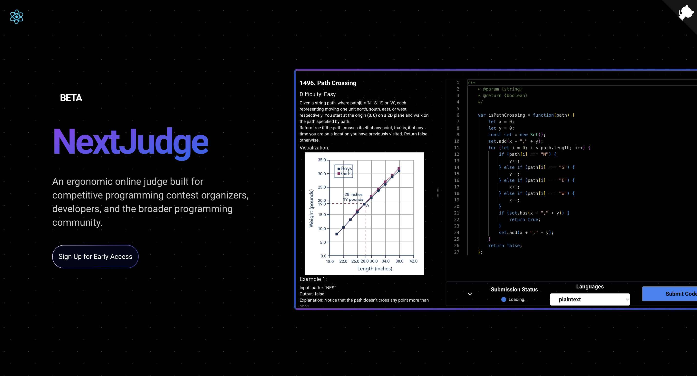

# NextJudge

Welcome to the official NextJudge Monorepo. This repository contains all the code for the NextJudge platform and services.

## Getting Started

NextJudge is a code execution engine, database, api gateway, and web application. We're building NextJudge to be a platform for competitive programming, coding challenges, and code execution.

### Quickly deploy

The top-level `docker-compose.yml` will instantiate all modules.

```sh
docker-compose up --build
```

## Developing

For quick iteration, we provide two different methods of setting up a local deployment.

### 1. Running everything on host

The first method attempts to install the following tools locally:

```sh
postgres
redis
go
bun
node
```

We still run postgres & the judge in the Docker container. Run the `./dev-host-init.sh` script to set these up.

```sh
./init-dev-host.sh
```

Now, start it with:
```sh
./start-dev-host.sh
```

To bring it all down, run:
```sh
./kill-dev-host.sh
```

### 2. Docker with hot reload

The second option will use Docker, but will mount folders containing applications data, allowing for hot reload when changing the files on the host. This prevents the need to install the compilers and runtime tools onto the host (Bun, Rust, Go), while still allowing rapid development, avoiding the need to restart the Docker containers constantly.

```sh
./dev-docker-run.sh
```


### Prerequisites

- [Bun.js](https://bun.sh/)
- [Docker](https://www.docker.com/)
- [Docker Compose](https://docs.docker.com/compose/)
- [Go](https://golang.org/)

### Installation

1. Clone the repo
```sh
git clone https://github.com/NextJudge/NextJudge.git
```

Open the `README.md` file in `/src/*` to get started with the specific service you want to run.
```
app - the frontend application
bridge - interface to the application, listens on HTTP and WebSockets. Acts as a proxy - a "middleman" - that sends requests to data-layer and engine
data-layer - HTTP wrapper over underlying database
engine - runs and judges code submissions
```

## Usage

We're in development of a compose file to run all the services at once. For now, you can run each service individually. This means you'll need to run the database, api gateway, and web application separately.

## Roadmap

- [x] Convert to a monorepo
- [ ] Develop compose file to run all services at once in production mode
- [ ] Write compose file to run all services at once in development mode
- [ ] Create a compose file to run all services at once in test mode
- [ ] Write tests for all services
  - [ ] Database
  - [x] API Gateway
  - [ ] Web Application
  - [ ] Code Execution Engine
- [ ] Create a CI/CD pipeline
- [ ] Write documentation for all components
  - [ ] Database
  - [x] API Gateway
  - [ ] Web Application
  - [ ] Code Execution Engine
- [ ] Create a user interface for the web application
  - [ ] User authentication
  - [ ] Admin authentication
  - [ ] Admin dashboard
  - [x] User dashboard
  - [x] Code editor
- [ ] Integrate database with API Gateway and Web Application
  - [x] Bearer token authorization
  - [x] User authentication
  - [ ] Admin authentication
  - [ ] Code execution websocket
  - [x] Integration tests

## Contributing

We are open to contributions. Please read [CONTRIBUTING.md](/CONTRIBUTING.md) for details on our code of conduct, and the process for submitting pull requests to the project.

## License

This project is licensed under the MIT License - see the [file](/LICENSE) for more details.

More information coming soon. Stay tuned! :octocat:!
