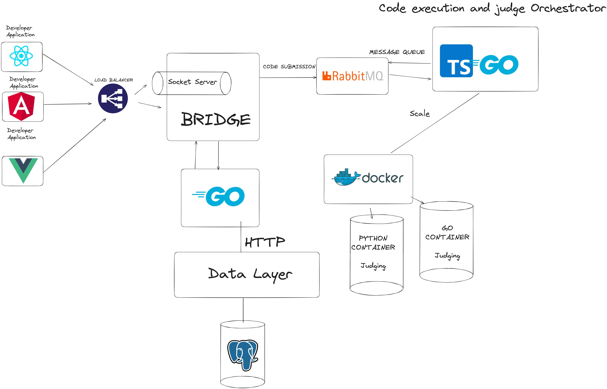
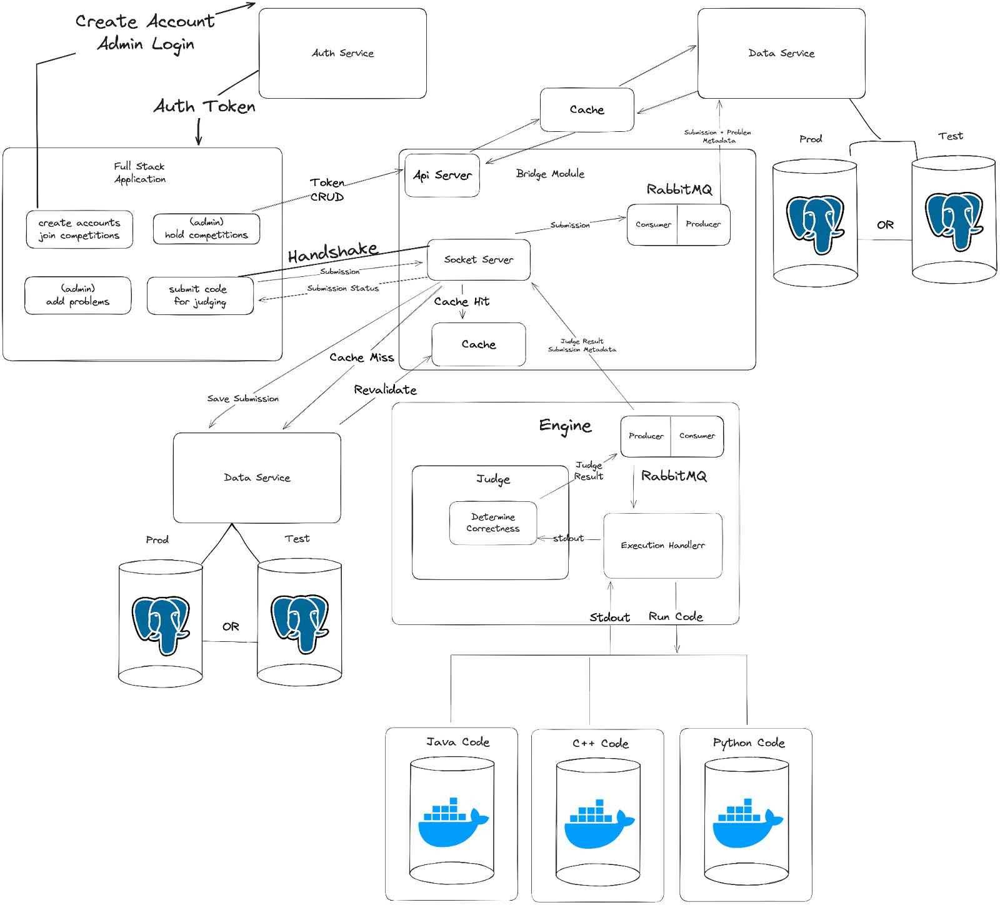
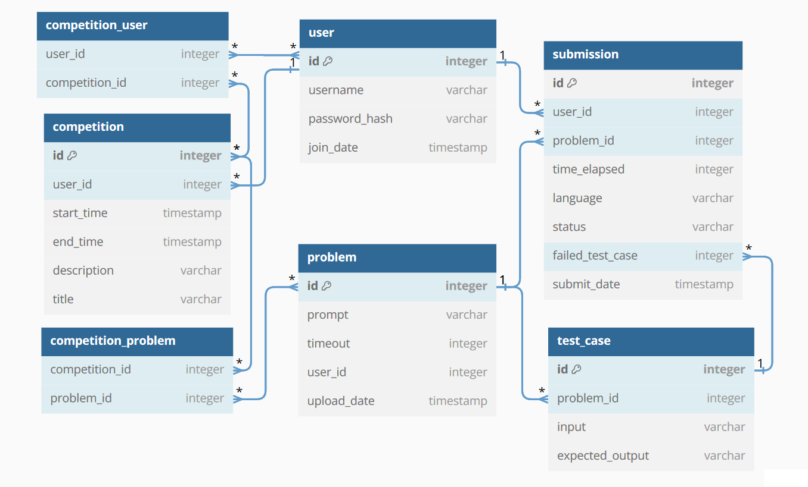
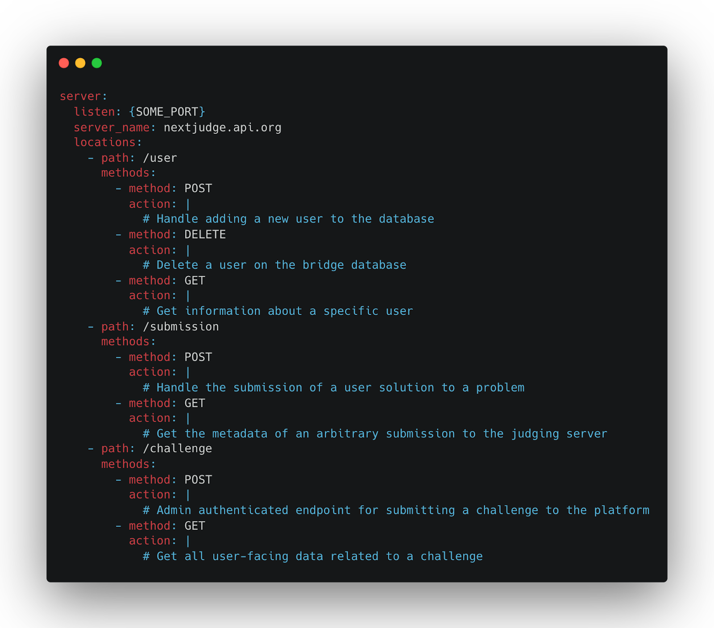

# NextJudge - Software Design and Architecture

The following document outlines the following in reference to architecture of NextJudge.

1. Introduction
2. Architectural Goals and Principles
3. System Overview
4. Architectural Patterns
5. Component Descriptions
6. Data Management
7. Interface Design
8. Considerations (Security, Performance, Maintenance and Support)
9. Deployment Strategy
10. Testing Strategy
11. Glossary

## Introduction

We are creating an open source, extensible, and modular competitive programming code execution and judging framework for developers. This document describes the high-level architecture of the framework and the real-world constraints that drive our architectural decisions. The goals of the project are, chiefly, to create a usable, secure, performant, scalable, and extensible platform for developers so that our project is easy to integrate into their application.

The final product will have multiple de-coupled subsystems - each a separate code base - that communicate with each other using socket connections. The viability of the project stands solely on the high level architecture. To ensure the system is horizontally scalable, extensible, and easy-to-use, the architecture must allow for it. 

## Architectural Goals and Principles

The key objectives of the architecture are as follows - ease of use, security, performance, and extensibility by developers using the framework.

Outlined in our product requirement document and summarized here is an explicit design goal of the project: the framework is fundamentally modular. This means the subsystems are decoupled, they can be replaced by other implementations that satisfy the same public APIs, and, most crucially, they can be used independently from each other. If a developer only wants the judging aspect of our code base, they should be able to use that repository, and it should have no dependencies on the other modules, like the frontend or the bridge.

Additionally, because of the nature of competitive programming, users will be submitting untrusted code that runs on a machine managed by the developer, so it must be executed in a sandboxed environment to prevent security breaches. Not only that, but competitive programming contests and environments can have dozens, hundreds, if not thousands of users, which adds additional considerations.

Due to these overarching design goals, the architecture focuses on modularity, lack of coupling, security, and scalability.

## System Overview

As we can see, the ‘NextJudge’ system will be broken into multiple independent components - one that handles code execution and judging, one - the bridge - that acts as a database and public interface to the judge, and one - the data layer - which abstracts the underlying database being used. These are all backend daemon services.

Developers will mainly interact with the bridge. It listens on a WebSocket endpoint to handle requests, and works with the judge to handle code submissions, and interacts with the data layer to track user progress. 

The judge takes code submissions, compiles them, and runs them against a series of test cases. The response contains the result of the tests - whether it succeeded or failed. It uses Docker to run code in a consistent and secure environment. For scalability - because code submissions may run for several seconds, and may be queued for longer - the bridge and the judge interact using a RabbitMQ Pub/Sub endpoint.

The bridge also interacts with the data layer. This is simply a wrapper over a database - it converts HTTP requests that contain instructions to add, delete, and modify values in the database to the actual commands that the underlying database technology, like SQL, takes. This allows the underlying database technology to be swapped with the high level API staying the same.

In addition to these backend daemons, we will build a full-stack application that uses our bridge. This will act as the default developer experience - they can clone our full-stack application and extend it for themselves.

The diagram below shows the high-level architecture of the components and the communication between them.

The diagram below contains more in-depth details of the communication between the components, including authentication, caching, and data flow. 

## Architectural Patterns

At a high level, we use the “microservice” pattern to implement the various modules. They are all separate processes that communicate with each other over sockets. We chose this for the modularity/decoupling goals. As long as the modules implement the agreed-upon public API’s, their internal implementations do not matter, and they can be swapped out for another implementation if a developer chooses.

An application backend in relation to the bridge is a “client-server” relationship, as the bridge listens for connections and responds, but does not initiate connections back to it without being prompted. This makes it easy to integrate our application as a microservice to a developers project. All they need to do is spin up an instance of the bridge/judge combination, and they can just treat the bridge as a server that they connect to in order to fulfill their needs.

Additionally, for performance, we will use the Pub/Sub model to communicate between the bridge and judges. In cases, there will be dozens, or hundreds of submissions during a coding contest. For performance reasons, they have to be queued, because every single one of them has to be run in the same environment to ensure timing and memory is consistent. TCP socket connections would sit waiting, which is an unneeded network and performance overhead. Insead, we use Pub/Sub, which allows the developer and the bridge to publish submissions, and subscribe to the results, to be updated about the results of the submission when it becomes available.

## Component Descriptions

There are three high level components on the backend. 

Judging execution environment
- The judging environment is a sandbox environment where user submission to challenges - in the form of uncompiled code - gets sent for compilation and execution.
- This is “remote-code-execution” as a service, and thus the main goal is security, followed by performance. 
- The judging environment will not only execute the code, but also judge its validity - does it pass a series of tests or not? 

Bridge
- A backend daemon application that listens on an WebSocket endpoint for directions from the developer application
- This will contain a persistent database of user information - authentication information, challenge progress, points, and problem submission data, which are all standard for competitive programming platforms.
- Acts as the gateway between the judging environment and developers applications
- This component is not end-user facing. It is intended that developers of a web application, for example, would get requests from users to their web backend, interpret those requests, and forward them to the bridge to execute an action. 

These are the two core “backend” modules that make up the project. They are the “novel” product we are creating. However, the project would be incomplete with just these two components. In addition to these backend services, we are creating an application that wraps a database - the data layer - allowing for the database technology to be swapped out.

Finally, to allow 3rd party clients (students, ACM members) to interact with our services, we are creating a full-stack application that uses the bridge and the judge as a microservice to run and judge code - mimicking the way a developer would use them in their own project.

Data Layer
- Gateway to our application storage and database
- Will be behind JWT authentication and authorization to prevent malicious access
- Other services will authenticate themselves to be able to access our data layer
- HTTP requests access and data transmission through JSON

Full-stack application
- This application will use the bridge as a microservice to implement a competitive programming platform, where users can login via a web interface, submit problems, and admins can do the same to manage the platform, add problems.
- Backend
    - The backend of the app speaks with a self-hosted instance of the bridge, which handles user data related to the competitive programming aspect of the platform. The backend sends the appropriate requests to the judge on user submission, and awaits responses on the status of the submission.
- Frontend
    - This is the user interface that users see when they visit the application in a browser. It contains the ability to login, submit code, and for admins to view progress, run events, and upload challenges.

## Data Management

Our “bridge” module is the component that contains all stateful data management. There is a REST API endpoint that manages the updating of this data. The API is described in the next section of this document, “Interface design”.

We plan on using the tried and true SQL relational database to handle user data. The following data, at a minimum, is stored in the database. We will use a Postgres database but the service that reads from the database and exposes the API for interacting with it will be platform agnostic and can run on top of any SQL implementation.

## Interface Design

The goal is to keep the API minimal and easy to understand. The following API is exposed by the bridge via a Websocket API. The websocket will listen for events, with each having a “type” to identify the action associated with it as well as the specifics of the data, which will be passed in JSON format.

## Considerations

### Security

Security is an absolute priority. The judging environment will allow, in theory, arbitrary code execution. We have a multi-pronged approach to stopping malicious actors from gaining unauthorized access to machines. At the code execution level, we will implement syscall filtering, to stop all syscalls except the ones relevant to competitive programming, namely read and write. Additionally, the code is running in a Docker environment, giving another layer of security. 

All the HTTP endpoints will have HTTPS support enabled, and strongly encouraged for use by default. 

There is role-based access for user data - namely an admin role that developers can divvy out. 

Because all requests are filtered through multiple API’s, we have multiple places to implement sanitation of requests, to prevent things like SQL injection.

### Performance
Performance is absolutely a core requirement. When a user submits a solution, they need to get a result as fast as possible. Due to the architecture and design goals, the nature of the submodules means that requests are, by default, passed through at least 3 network connections to get to the judge and back to the user. To negate this, we focus on horizontal scalability and lowering bridge-to-judge latency.

To meet these needs, we will use container orchestration with Kubernetes to handle horizontal scaling of docker containers running the judging environment. Because of the possibility of many users using a platform, we will implement caching of testing input, and use technologies such as RabbitMQ, to queue user submissions in an asynchronous fashion. We will also implement local web browser caching to ensure un-needed requests are not sent and that unnecessary data is not sent over the wire.

### Maintenance and Support

This is an open source project, so maintenance is an important part of the project. We will use SEMVER to manage releases, and make sure documentation is always up to date. When we make our first 1.0.0 release at the end of the academic year, we are opening up the project to the open source community. Developers from around the world will contribute to the project. They will be developers who use the project and are already intimately involved with it because they use it.

Through GitHub, we will constantly collect feedback that will inform future development.

## Deployment Strategy

Deployment, in our case, does not apply in the traditional sense. We are creating a framework that can be self-hosted, so we do not provide deployment services. However, we will provide documentation on the specific hardware specifications for reliable and performant deployments in the form of compute, memory, and storage. These details will emerge as we decide the final technologies and run the implementations.

## Testing Strategy
Unit testing will occur on all PR’s, to ensure that there are no regressions and new features work as intended. If the backend is coded using TypeScript, we will use Jest for running the tests.

Integration tests are the most important tests for the project. In most cases, once a unit test passes in our codebase, it will continue to pass forever unless a giant codebase change is made. However, for integration tests this is not the case. Integration tests will ensure that our API’s stay stable, that we don’t miss anything during refactoring. For integration testing, we will need to spin up an entire instance of the given thing being tested, for example the bridge and judge, and all the intermediate caching and communication technologies. Then, we will inject requests, monitor that everything is working as intended.

## Glossary
API - Application Programming Interface
CRUD - Create, Read, Update, and Delete
PR - Pull request
Pub/Sub - Publish-subscribe pattern, as opposed to traditional HTTP request and response.
WebSockets - A two-way communication channel over TCP, allowing
JWT - Json Web Tokens 

## Quick Links
https://gorm.io/docs/ - Fully featured Go ORM
https://bun.sh/ - Cutting JavaScript/TypeScript Runtime
https://echo.labstack.com/ - High performance minimalist Go web framework
