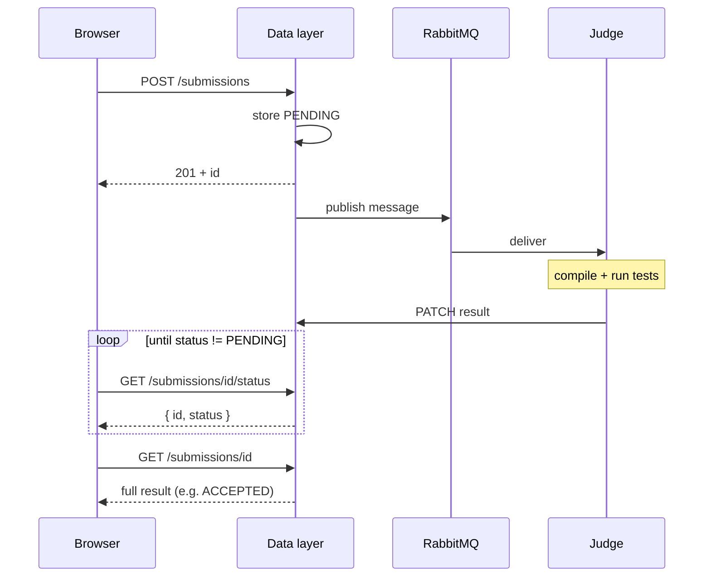

The platform has four application services, two data stores and one work queue.

## Web (`src/web`)

Next.js on port **8080**. Handles authentication, problem list, Monaco editor, contests (including team registration) and leaderboards.

The web app calls the data layer over REST. Server state uses **TanStack React Query** (`src/web/src/hooks/queries/`) for contests, notifications, languages and submission status. After submit, the UI polls submission status on a fixed interval.

### Why polling instead of WebSockets

Submission grading takes seconds to minutes. Polling at 500ms–1s gives acceptable feedback without WebSocket infrastructure, reconnect handling or a separate auth channel. For contest scale today, that balance favors operational simplicity.

| Approach | Pros | Cons |
| -------- | ---- | ---- |
| **Polling (current)** | Works everywhere; no extra infra; easy to debug | More HTTP requests while waiting; latency bounded by poll interval |
| **SSE (likely next step)** | Server push over one long-lived GET; near-instant updates when judge PATCHes | Proxy timeout tuning; reconnect handling; still one-way |
| **WebSockets** | Bidirectional; lowest latency | Heavier ops (sticky sessions, auth channel); overkill for status-only updates |

Current intervals:

- Platform **Run** (custom input): 500ms poll on `/v1/input_submissions/:id`
- Platform **Submit**: 1s poll on `/v1/submissions/:id/status`, then one full fetch when complete
- Landing demo: 500ms poll, 30-attempt cap (~15s)
- CLI: exponential backoff up to 3.5s

Poll GETs are cheap reads; POST and enqueue paths are rate-limited separately. If you need real-time collaboration or sub-100ms status, SSE on top of the existing REST endpoints is a natural next step. RabbitMQ remains internal to the judge pipeline.

**Multi-instance note:** IP and user rate limiters are in-memory per data-layer process. Horizontal scaling requires a shared store (for example Redis) for consistent limits across replicas.

## Data layer (`src/data-layer`)

Go REST API on **5000**. Owns the Postgres schema, JWT auth and RabbitMQ enqueue.

| Prefix | What |
| ------ | ---- |
| `/v1/users`, `/v1/problems`, `/v1/submissions` | Core CRUD |
| `/v1/events` | Contests (the API uses "events") |
| `/v1/input_submissions` | "Run" without grading |
| `/v1/languages` | Runtime registry |
| `/v1/basic_*`, `/v1/create_or_login_user` | Auth ([details](/reference/authentication/)) |
| `/healthy` | Liveness |

Optional Elasticsearch powers problem search when `ELASTIC_ENABLED=true`. Most development setups leave it disabled.

## Judge (`src/judge`)

Python worker. Pulls from RabbitMQ, fetches tests from the API, compiles and runs in nsjail, PATCHes the result.

`prefetch_count=1` limits each worker to one submission at a time. Under heavy load, add judge containers rather than increasing CPU on a single worker.

Details: [Judge service](/architecture/judge/).

## RabbitMQ

Buffers between "user clicked submit" and "judge finished running tests." The API responds with `PENDING` immediately; execution is asynchronous.

Messages are durable. If a judge restarts mid-contest, unacked work returns to the queue. The management UI is on **15672** when exposed.

During load tests, watch queue depth. A flat line near zero is healthy. A steady climb means add judges or fix failing workers.

## PostgreSQL

Stores users, problems, test cases, submissions, events and languages.

GORM AutoMigrate runs on startup. That suits development; take a backup before production upgrades.

## CLI (`src/cli`)

Command-line download, local test and submit. See the [CLI guide](/guides/cli/).

## Submission path

Custom input runs (`/v1/input_submissions`) skip test comparison but follow the same queue and judge path.

## Common failure modes

| Symptom | Likely cause |
| ------- | ------------ |
| Instant 201 then eternal PENDING | Judge down, wrong `JUDGE_PASSWORD`, or RabbitMQ auth |
| COMPILE_TIME_ERROR on everything | Language ID mismatch between DB and `languages.toml` |
| API 401 after working earlier | User deleted, token malformed, or `Bearer` prefix added by mistake |
| Web shows data, curl doesn't | Missing or wrong `Authorization` header |

Troubleshooting steps: [Getting started](/start/getting-started/#troubleshooting).
