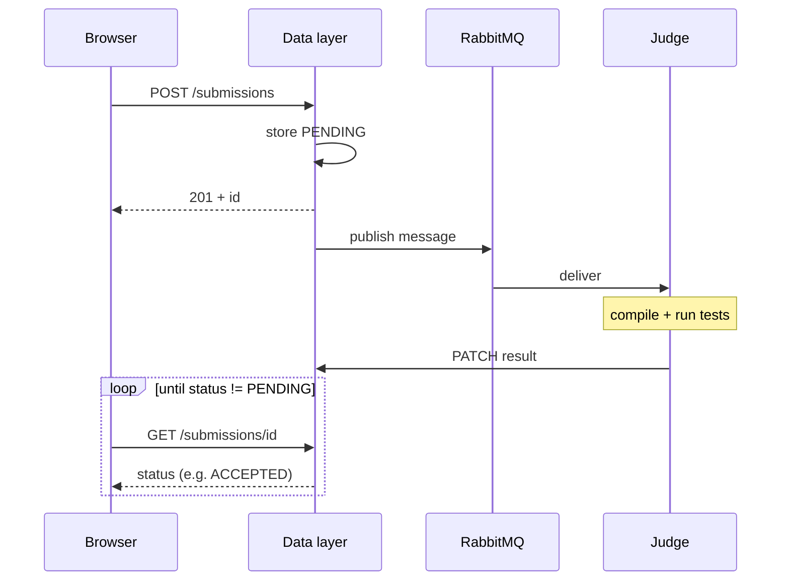

Four services, two data stores, one queue. That's the whole system.

## Web (`src/web`)

Next.js on port **8080**. Auth, problem list, Monaco editor, contests, leaderboards.

Calls the data layer over REST. After you submit, the UI **polls** submission status every few seconds.

### Why polling, not WebSockets?

Honest answer: simpler to ship and good enough for contest scale today. Submission grading takes seconds to minutes; a poll interval of 1-2s feels live without maintaining WS infra, reconnect logic, and auth on a second channel.

Tradeoff: slightly higher API load during active editing sessions. If you're building real-time collaboration, you'd add WS or SSE yourself. The API already has the data; the transport is the missing piece.

## Data layer (`src/data-layer`)

Go REST API on **5000**. Postgres schema, JWT auth, RabbitMQ enqueue.

| Prefix | What |
| ------ | ---- |
| `/v1/users`, `/v1/problems`, `/v1/submissions` | Core CRUD |
| `/v1/events` | Contests (yes, "events" in the API) |
| `/v1/input_submissions` | "Run" without grading |
| `/v1/languages` | Runtime registry |
| `/v1/basic_*`, `/v1/create_or_login_user` | Auth ([details](/reference/authentication/)) |
| `/healthy` | Liveness |

Optional Elasticsearch for problem search when `ELASTIC_ENABLED=true`. Most dev setups leave it off.

## Judge (`src/judge`)

Python worker. Pull from RabbitMQ, fetch tests from API, compile + run in nsjail, PATCH result.

`prefetch_count=1`: one submission per worker at a time. Contest with 200 participants submitting problem A at minute 59? Run more judge containers, not bigger CPUs on one.

Deep dive: [Judge service](/architecture/judge/).

## RabbitMQ

Buffer between "user clicked submit" and "judge finished running tests." API responds fast with `PENDING`; execution happens async.

Messages are durable. Restart a judge mid-contest and unacked work returns to the queue. Management UI on **15672** when exposed.

Watch queue depth during load tests. Flat line at zero is healthy. Monotonic climb means add judges or fix broken workers.

## PostgreSQL

Users, problems, test cases, submissions, events, languages. Single source of truth.

GORM AutoMigrate on startup. Fine for dev; back up before prod upgrades.

## CLI (`src/cli`)

Terminal workflow for people who live in `vim`. [CLI guide](/guides/cli/).

## Submission path (the whole story)

Custom input runs (`/v1/input_submissions`) skip test comparison but follow the same queue + judge path.

## Failure modes worth knowing

| Symptom | Likely cause |
| ------- | ------------ |
| Instant 201 then eternal PENDING | Judge down, wrong `JUDGE_PASSWORD`, or RabbitMQ auth |
| COMPILE_TIME_ERROR on everything | Language ID mismatch between DB and `languages.toml` |
| API 401 after working earlier | User deleted, token malformed, or `Bearer` prefix added by mistake |
| Web shows data, curl doesn't | Missing or wrong `Authorization` header |

Getting unstuck: [Getting started troubleshooting](/start/getting-started/#troubleshooting).
